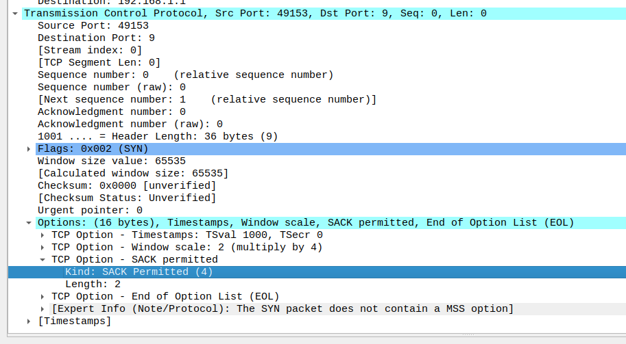

# Introduction
​Exhaustive evaluation of TCP Selective 
Acknowledgments in WiFi environments.

TCP SACK is a loss recovery algorithm and has been widely deployed in all end host
operating systems. It has an additional property of improving the TCP performance in wireless networks. 

ns-3 has an in built model for SACK. This project aims to evaluate the performanceof different TCP extensions in wireless networks, with and without SACK.

# Why SACK is more relevant when used in Wireless over wired networks?
- Since chances of packet loss is way higher in general in wireless than wired so retransmissions happens faster if SACK is used. Plus the application at the receiver side won't need to wait for longer gaps to be filled in the receiver buffer.

- Delivery rate or data rate estimatation is more accurate if SACK is used, hence it helps many wireless alogrithms like Westwood.

# Setup
- Network Simulator: ns-3-dev
- Operating System: Ubuntu 20.04.2 LTS

# Weekly Progress

## Week1: 
- Install and setup ns-3.30.1
- Understand SACK implementation in ns-3: [TCP SACK and non SACK](https://www.nsnam.org/docs/models/html/tcp.html#tcp-sack-and-non-sack)

## Week2:
- Created sample programs to change TCP extensions in ns-3.
- Understood setting up WiFi Nodes and positioning them.

## Week3:
- Created a simple topology to measure average throughput in Wifi environment.
- Added a command line argument to set sack ON or OFF.
- Topology: AP0 (having 2 STAs), AP1 (having 1 STA)
- Application used: PacketSinkHelper on APs, OnOffHelper on STAs

## Week4: 
- Switched to ns-3-dev
- Introduced `YansErrorRateModel`
- Used `LogDistancePropagationLossModel` to introduce loss in wifi channel
- Analyzed pcap files in Wireshark and found TCP Option SACK_PERM 
- When loss was introduced, we found TCP Option SACK turned on in DUP ACKs

    
## Week5:
- Changed Loss model back to `FriisPropagationLossModel` to evaluate error introduction in the network by other criterions.
- Changed the data rate and distance between the nodes and APs and repeated the experiment. Analyzed the pcap file for prescence of TCP SACK and SACK_PERM options. The results are summarized in the below table.

| Payload size in bytes | Application layer datarate | Phy layer Bitrate | AP0 to STA00 distance | AP0 to STA01 distance | Avg Throughput at AP0 (Mbits/sec)| AP1 to STA10 distance | Avg Throughput at AP1 (Mbits/sec) | Pcap observations from wireshark |
|:-------------:|:-----------------:|:---------:|:------------:|:------------:|:---------------:|:------------:|:---------------:|:------------------------------------------------------------------------------------------------------------------------------------------------------------------------------------------------------------------------------------------------------------------:|                                            
|          1472 | 100Mbps           | HtMcs7    |           30 |        50.99 |         49.2502 |           30 |         52.3502 | only SYN, SYN ACK had SACK_PERM on                                                                                                                                                                                                                                 |
|          1472 | 100Mbps           | HtMcs7    |          100 |          100 |         47.4749 |          100 |         51.5671 | only SYN, SYN ACK had SACK_PERM on                                                                                                                                                                                                                                 |
|          1472 | 100Mbps           | HtMcs7    |          110 |          120 |         46.7272 |          130 |         46.0206 | only SYN, SYN ACK had SACK_PERM on                                                                                                                                                                                                                                 |
|          1472 | 100Mbps           | HtMcs7    |          120 |          130 |         45.4171 |          140 |         28.5745 | STA10: SACK TCP option in 1 unseen segment packet. STA00, STA01: many DupACK had SACK TCP option, 1 original packet had SACK TCP option.                                                                                                                           |
|          1472 | 100Mbps           | HtMcs7    |          135 |          135 |         35.0719 |          145 |          2.1344 | STA10: unseen segments, DupACK had SACK TCP option on, STA01, STA00: many DupACK had SACK TCP option, 1 original packet had SACK TCP option.                                                                                                                       |
|          1472 | 100Mbps           | HtMcs7    |          130 |          140 |          40.377 |          150 |        0.079488 | STA01 and STA00: many DupACKs had SACK TCP option on, one original packet with SACK TCP option On. STA10: SACK TCP option used for DupACK and unseen segment                                                                                                       |
|          1472 | 100Mbps           | HtMcs7    |          160 |          170 |        0.002944 |          180 |               0 | STA10: only SACK_PERM On (Retransmission and out of order). STA01: many DupACKs SACK TCP option had on, one original packet with  SACK TCP option On. STA00: 2 DupACK had  SACK TCP option On, 2 ACK had  SACK TCP option, TCP window update had  SACK TCP option  |
|          1472 | 100Mbps           | HtMcs7    |          200 |          190 |               0 |          190 |               0 | None of the packets had SACK_PERM or  SACK TCP option On(No packets were received)                                                                                                                                                                                 |
|          1472 | 50Mbps            | HtMcs7    |           30 |        50.99 |         48.1285 |           30 |         49.0706 | only SYN, SYN ACK had SACK_PERM on                                                                                                                                                                                                                                 |
|          1472 | 50Mbps            | HtMcs7    |          100 |          100 |          47.787 |          100 |         47.7811 | only SYN, SYN ACK had SACK_PERM on                                                                                                                                                                                                                                 |
|          1472 | 50Mbps            | HtMcs7    |          110 |          120 |         46.4946 |          130 |         44.1777 | STA10: no SACK TCP option On seen. STA00, STA01: many DupACK had SACK TCP option, 2 original packets had SACK TCP option.                                                                                                                                          |
|          1472 | 50Mbps            | HtMcs7    |          120 |          130 |         44.3572 |          140 |          29.337 | STA10: SACK TCP option on in 1  unseen segment packet and 1 DupACK. STA00, STA01: many DupACK had SACK TCP option, 1 normal packet had SACK TCP option.                                                                                                            |
|          1472 | 50Mbps            | HtMcs7    |          135 |          135 |         34.2711 |          145 |          2.1344 | STA10: unseen segments and DupACK had SACK TCP option on. STA01, STA00: many DupACK had SACK TCP option, 3 original packets had SACK TCP option.                                                                                                                   |
|          1472 | 50Mbps            | HtMcs7    |          130 |          140 |         37.2593 |          150 |        0.079488 | STA01, STA00: many DupACKs had SACK TCP option on, 5 original packets with SACK TCP option On. STA10: SACK TCP option used for DupACK and unseen segment                                                                                                           |
|          1472 | 50Mbps            | HtMcs7    |          160 |          170 |        0.002944 |          180 |               0 | STA10 => only SACK_PERM On (Retransmission and out of order). STA01 => many DupACKs had SACK TCP option on, one original packet with SACK TCP option On. STA00 => 2 DupACK had SACK TCP option On, 2ACK had SACK TCP option, TCP window update had SACK TCP option |
|          1472 | 50Mbps            | HtMcs7    |          200 |          190 |               0 |          190 |               0 | None of the packets had SACK_PERM or SACK TCP option On(No packets were received)                                                                                                                                                                                  |
|          1472 | 25Mbps            | HtMcs7    |           30 |        50.99 |         46.8243 |           30 |         24.9946 | STA10: no SACK TCP option, STA01, STA00: many DupACKs having SACK TCP option                                                                                                                                                                                       |
|          1472 | 25Mbps            | HtMcs7    |          100 |          100 |         44.4573 |          100 |         24.9975 | STA10: no SACK TCP option, STA01, STA00: many DupACKs and 1 original packet having SACK TCP option                                                                                                                                                                 |
|          1472 | 25Mbps            | HtMcs7    |          110 |          120 |         44.4485 |          130 |         24.9946 | STA10: no SACK TCP option, STA01, STA00: many DupACKs and 2 simple packets having SACK TCP option                                                                                                                                                                  |
|          1472 | 25Mbps            | HtMcs7    |          120 |          130 |         41.8195 |          140 |         24.9445 | STA10: 2 unseen segment, 2 original packets, many DupACK had SACK TCP option, STA01, STA00: many SupACKs and 1 original packet having SACK TCP option                                                                                                              |
|          1472 | 25Mbps            | HtMcs7    |          135 |          135 |          34.121 |          145 |          2.1344 | STA10: many unseen segment and many DupACK had SACK TCP option, STA01, STA00: many DupACKs and  3 original packets having SACK TCP option                                                                                                                          |
|          1472 | 25Mbps            | HtMcs7    |          130 |          140 |         27.5382 |          150 |        0.079488 | STA10: 2 unseen segment,2 DupACKs had SACK TCP option. STA01, STA00: many dupACKs and 3 original packets having SACK TCP option                                                                                                                                    |

# Experiment Criteria

# Evaluation Parameters

# Team members: 
* **Manas Gupta**
    
 Github: [manas11](https://github.com/manas11)
    
* **Animesh Kumar**
    
 Github: [animeshk08](https://github.com/animeshk08)

* **Dhruv Agja**
   
 Github: [dhruv8808agja](https://github.com/dhruv8808agja)
