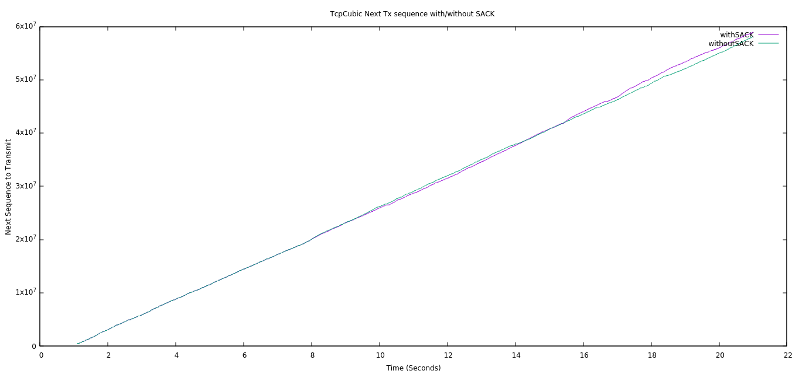

# Introduction
​Exhaustive evaluation of TCP Selective Acknowledgments in WiFi environments.

TCP SACK is a loss recovery algorithm and has been widely deployed in all end-host
operating systems. It has the additional property of improving the TCP performance in wireless networks. 

ns-3 has an in-built model for SACK. This project aims to evaluate the performance of different TCP extensions in wireless networks, with and without SACK.

# Why SACK is more relevant when used in Wireless over wired networks?
Since packet loss is way higher in general in wireless than wired, retransmissions happen faster if SACK is used. Plus, the application at the receiver side won't need to wait for longer gaps to be filled in the receiver buffer.

- Delivery rate or data rate estimation is more accurate if SACK is used; hence it helps many wireless algorithms like Westwood.

# Setup
- Network Simulator: ns-3-dev
- Operating System: Ubuntu 20.04.2 LTS

# Topology


# Weekly Progress

## Week1: 
- Install and setup ns-3.30.1
- Understand SACK implementation in ns-3: [TCP SACK and non SACK](https://www.nsnam.org/docs/models/html/tcp.html#tcp-sack-and-non-sack)

## Week2:
- Created sample programs to change TCP extensions in ns-3.
- Understood setting up WiFi Nodes and positioning them.


## Week3:
- Created a simple topology to measure average throughput in a WiFi environment.
- Added a command-line argument to set sack ON or OFF.
- Topology: AP0 (having 2 STAs), AP1 (having 1 STA)
- Application used: PacketSinkHelper on APs, OnOffHelper on STAs

## Week4: 
- Switched to ns-3-dev
- Introduced `YansErrorRateModel`
- Used `LogDistancePropagationLossModel` to introduce loss in wifi channel
- Analyzed pcap files in Wireshark and found TCP Option SACK_PERM 
- When loss was introduced, we found TCP Option SACK turned on in DUP ACKs


    
## Week5:
- Changed Loss model back to `FriisPropagationLossModel` to evaluate error introduction in the network by other criteria.
- Changed the data rate and distance between the nodes and APs and repeated the experiment. Analyzed the pcap file for prescence of TCP SACK and SACK_PERM options. 
- TCP Westwood is used for the experiments.
 
The results are summarized in this [table](./week5/TCPWestwood_distance_datarate.csv).

## Week6:
- Analyzed congestion window, transmitted sequence number, and throughput for different TCP variants.

- The TCP variants considered for the simulations include, `TCP BIC`, `TCP CUBIC`, `TCP High Speed`, `TCP HTCP`, `TCP Scalable`, `TCP Vegas` and `TCP Westwood`.

- The results can be found in the [week6](./week6) directory.

# Observations and Results

* To simulate a lossy channel in a wireless network, `YansErrorRateModel`. `NistErrorRateModel` or `TableBasedErrorRateModel` can be used. `YansErrorRateModel` has been used for these experiments. The error rate cannot be directly specified using either of the model mentioned above. Different amounts of error can be introduced by either using a loss model like , `LogDistancePropagationLossModel`, or by varying the datarate and distance between the nodes.
  
* SACK can be turned on for a simulation in ns3 by using the below line of code, where `sack` can be true/false.
  ```
    Config::SetDefault ("ns3::TcpSocketBase::Sack", BooleanValue (sack));
  ```
  
  TCP variant is modified the below line of code, where `tcpVarient` is a string with the name of the TCP variant to be used.
  ```
    Config::SetDefault ("ns3::TcpL4Protocol::SocketType", TypeIdValue (TypeId::LookupByName (tcpVariant)));
  ```

* On introducing errors in the channel, SACK and SACK_PERM options were found in the TCP header options by analyzing the pcap files on Wireshark.

* The transmitted sequence number is higher when SACK is enabled as compared to when it is disabled. This is because the transmission can recover quickly and send more data to avoid the retransmission of already received blocks.

* With SACK, the congestion windows are higher because it does fewer retransmissions (thanks to its principles), and there is a lower probability that a retransmitted segment is lost. 

TCP CUBIC congestion window with and without SACK enabled.


TCP CUBIC transmitted sequence numbers with and without SACK enabled.



# Team members: 
* **Manas Gupta**
    
 Github: [manas11](https://github.com/manas11)
    
* **Animesh Kumar**
    
 Github: [animeshk08](https://github.com/animeshk08)

* **Dhruv Agja**
   
 Github: [dhruv8808agja](https://github.com/dhruv8808agja)
