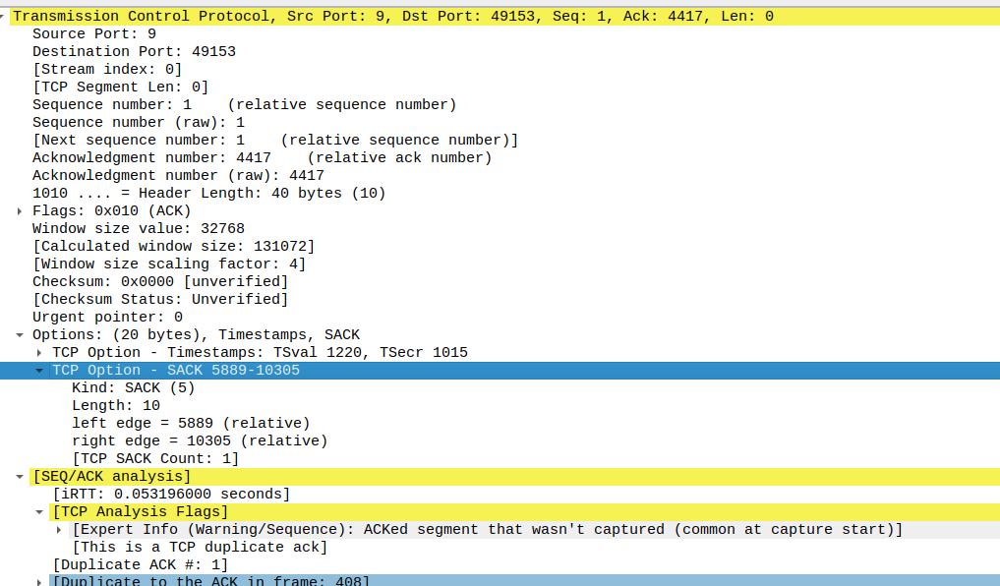

# Introduction
​Exhaustive evaluation of TCP Selective 
Acknowledgments in WiFi environments.

TCP SACK is a loss recovery algorithm and has been widely deployed in all end host
operating systems. It has an additional property of improving the TCP performance in wireless networks. 

ns-3 has an in built model for SACK. This project aims to evaluate the performanceof different TCP extensions in wireless networks, with and without SACK.

# Why SACK is more relevant when used in Wireless over wired networks?
- Since chances of packet loss is way higher in general in wireless than wired so retransmissions happens faster if SACK is used. Plus the application at the receiver side won't need to wait for longer gaps to be filled in the receiver buffer.

- Delivery rate or data rate estimatation is more accurate if SACK is used, hence it helps many wireless alogrithms like Westwood.

# Setup
- Network Simulator: ns-3-dev
- Operating System: Ubuntu 20.04.2 LTS

# Weekly Progress

## Week1: 
- Install and setup ns-3.30.1
- Understand SACK implementation in ns-3: [TCP SACK and non SACK](https://www.nsnam.org/docs/models/html/tcp.html#tcp-sack-and-non-sack)

## Week2:
- Created sample programs to change TCP extensions in ns-3.
- Understood setting up WiFi Nodes and positioning them.

## Week3:
- Created a simple topology to measure average throughput in Wifi environment.
- Added a command line argument to set sack ON or OFF.
- Topology: AP0 (having 2 STAs), AP1 (having 1 STA)
- Application used: PacketSinkHelper on APs, OnOffHelper on STAs

## Week4: 
- Switched to ns-3-dev
- Introduced `YansErrorRateModel`
- Used `LogDistancePropagationLossModel` to introduce loss in wifi channel
- Analyzed pcap files in Wireshark and found TCP Option SACK_PERM 
- When loss was introduced, we found TCP Option SACK turned on in DUP ACKs

    
## Week5:
- Changed Loss model back to `FriisPropagationLossModel` to evaluate error introduction in the network by other criterions.
- Changed the data rate and distance between the nodes and APs and repeated the experiment. Analyzed the pcap file for prescence of TCP SACK and SACK_PERM options. 
- TCP Westwood is used for the experiments.
 
The results are summarized in this [table](./week5/TCPWestwood_distance_datarate.csv).                        

# Team members: 
* **Manas Gupta**
    
 Github: [manas11](https://github.com/manas11)
    
* **Animesh Kumar**
    
 Github: [animeshk08](https://github.com/animeshk08)

* **Dhruv Agja**
   
 Github: [dhruv8808agja](https://github.com/dhruv8808agja)
