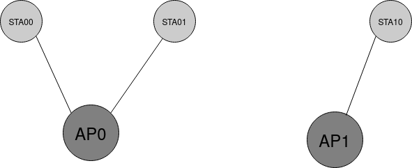
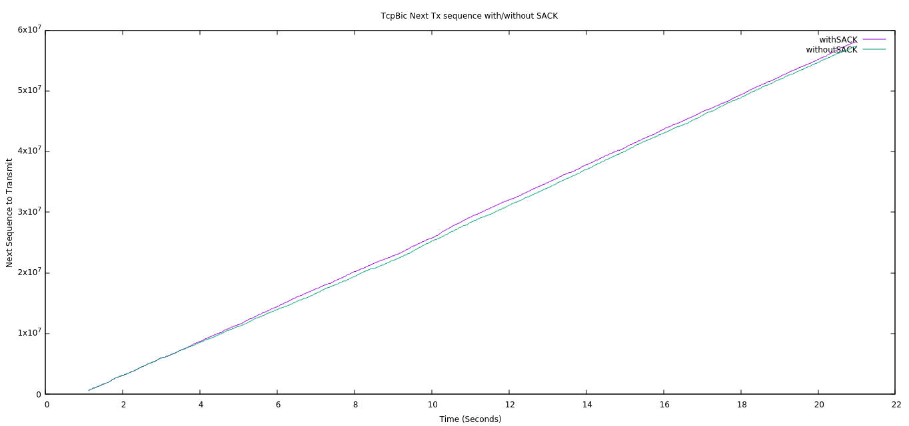
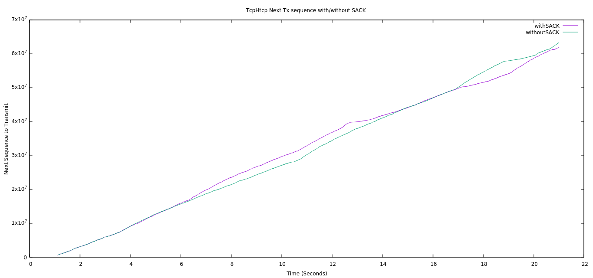
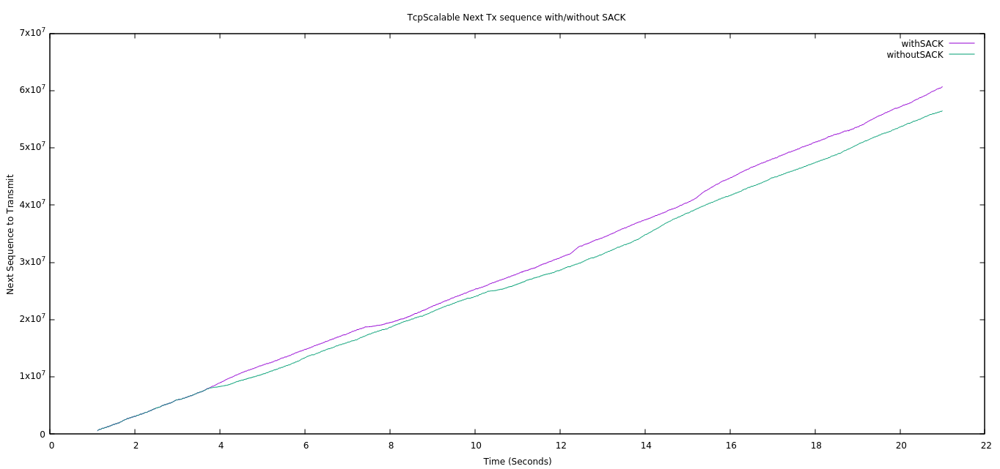
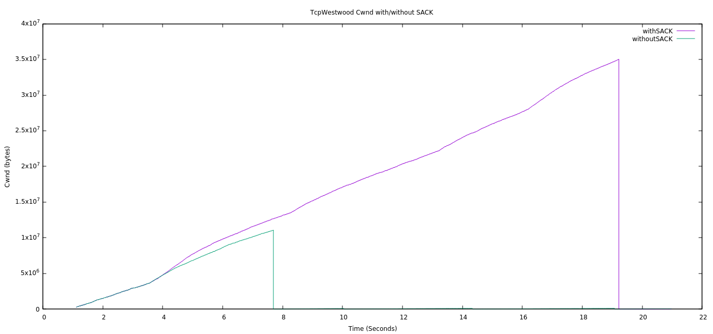
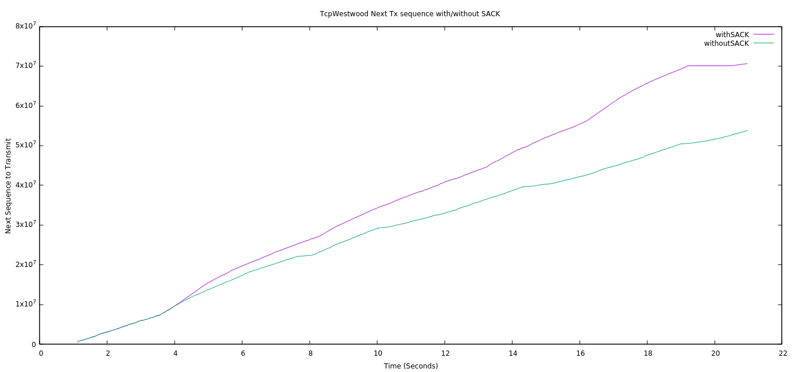

## Comparsion of different TCP variants with SACK option enabled/disabled

* This directory contains results of simulation of different TCP variants including, `TCP BIC`, `TCP CUBIC`, `TCP High Speed`, `TCP HTCP`, `TCP Scalable`, `TCP Vegas` and `TCP Westwood`.
* The parameters analyzed includes, congestion window, sequence number and throughput.

The topology used is shown in the below figure.

The cofiguration of the network is included in the below table.

| Payload size | Application layer datarate | Phy layer Bitrate | AP0 to STA01 distance | AP0 to STA01 distance | AP1 to STA10 distance |
|----------|------|--------|-------|-------|--------|
|1472 bytes|50Mbps|HtMcs7|120|130|140|

## Results

The throghuput related results can be found in the file [TCP_variants_Tthroughput.csv](./TCP_variants_throughput.csv).

### TCP BIC

#### Congestion window

#### Transmitted Sequence number

### TCP CUBIC

#### Congestion window

#### Transmitted Sequence number

### TCP High Speed

#### Congestion window

#### Transmitted Sequence number

### TCP HTCP

#### Congestion window

#### Transmitted Sequence number

### TCP Scalable

#### Congestion window

#### Transmitted Sequence number

### TCP Vegas

#### Congestion window

#### Transmitted Sequence number

### TCP Westwood

#### Congestion window

#### Transmitted Sequence number

